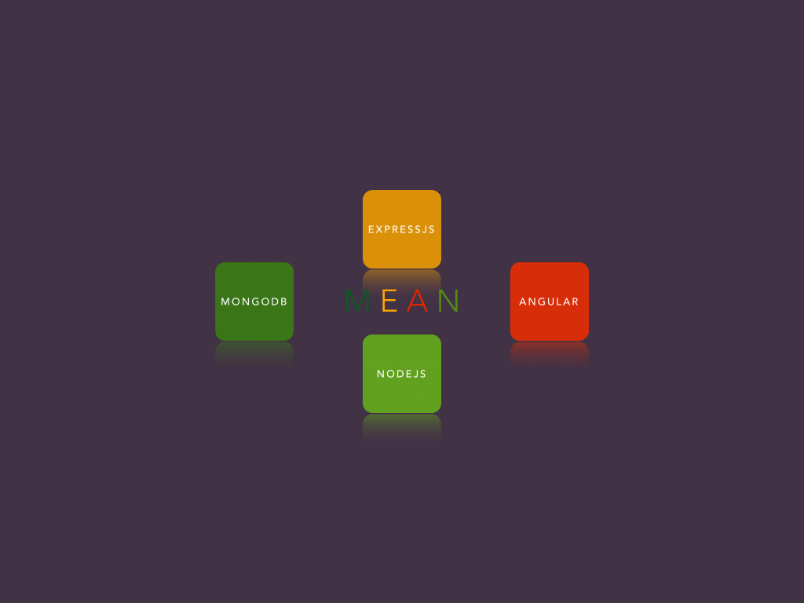

As a developer with some experience in Node.js and Angular, I was interested in
learning how to build full-stack applications using the MEAN stack. So, I set
out to learn it in a week, and to my surprise, I was able to pick it up
relatively quickly. Here's how I did it.

# What is MEAN?

MEAN is an acronym that stands for MongoDB, Express.js, Angular, and Node.js.
Together, these technologies form a powerful full-stack web development
framework.

# My Background

Before I started learning MEAN, I already had experience with Node.js and
Angular, but I was not familiar with HttpClient. So, I had a good grasp of
JavaScript and TypeScript.

# The Learning Process

I started by reading the documentation for each technology and watching video
tutorials. I also took an online course that covered the basics of MEAN. This
gave me a good understanding of the framework and how the technologies fit
together.

After that, I started working on a simple project to put my newly acquired
skills into practice. I decided to build a to-do app using the MEAN stack.

I started by setting up the backend with Node.js and Express.js, and connected
it to a MongoDB database. Then, I built the frontend with Angular and used
HttpClient to make HTTP requests to the backend.

While building the app, I encountered several issues and bugs, but I was able to
solve most of them by researching online and asking for help on developer
forums.

# Conclusion

Learning MEAN stack development in a week was a challenging but rewarding
experience. With my prior experience in Node.js and Angular, I was able to pick
up the framework relatively quickly. With MEAN, I now have the skills to build
powerful full-stack web applications.

# Next Steps

Learning MEAN in a week was a challenging but rewarding experience. With my
prior experience in Node.js and a little familiarity with Angular, I was able to
learn the basics of MEAN quickly and build a simple project.

However, I'm not stopping there. My next goal is to explore other full-stack web
development frameworks, such as MERN.

But, that's a story for another blog...
