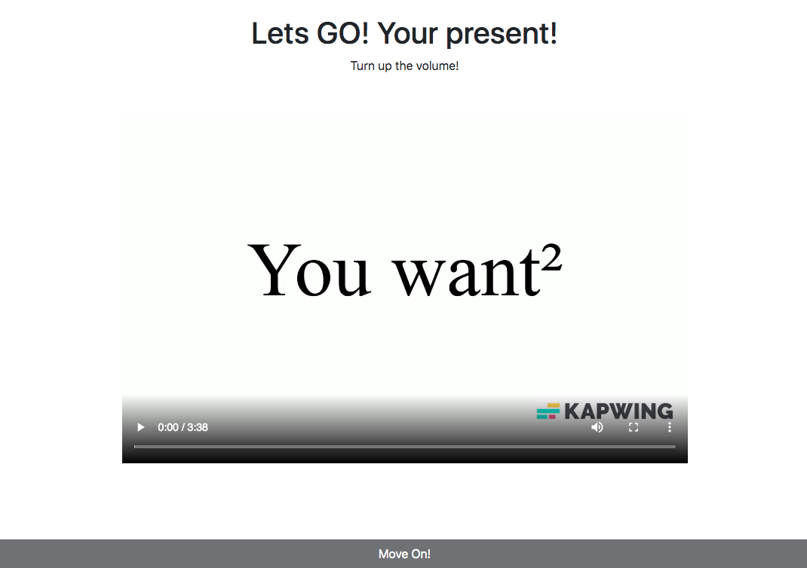

## Introduction

I recently learned React, one of the most popular JavaScript frameworks in the
world. I also created a gift for my sister using React. The main feature of the
present is a video that contains a rickroll. When the rickroll plays, it should
enable a previously disabled button.

{/* truncate */}

## Getting Started

:::caution

Note: This tutorial assumes you have a react-ts or react app with vite included.
So, if you don't have the project up and running, please visit
[the Vite docs](https://vitejs.dev/guide/#scaffolding-your-first-vite-project).

:::

## Step 1: Add a video to `App.tsx`.

You can include a video using the HTML `<video>` tag.

Here's an example:

```tsx title="/src/App.tsx" showLineNumbers
import rickRoll from "./rickroll.mp4";
import "./App.css";

function App() {
  return (
    <>
      <div>
        <video src={rickRoll} width="750" height="500" controls></video>
      </div>
    </>
  );
}

export default App;
```

In this code, make sure to place the video file (rickroll.mp4) in the public
folder.

## Step 2: Adding Refs

If you're new to React and aren't familiar with what a ref is, think of it as a
way to reference an element similar to `document.querySelector` in vanilla
JavaScript.

In React, using refs is considered a best practice instead of directly using
`document.` functions.

Let's add refs to our video tag:

```tsx title="/src/App.tsx" showLineNumbers
import { createRef } from "react";
import rickRoll from "./rickroll.mp4";
import "./App.css";

function App() {
  const videoRef = createRef<HTMLVideoElement>();

  return (
    <>
      <div>
        <video
          src={rickRoll}
          width="750"
          height="500"
          ref={videoRef}
          controls
        ></video>
      </div>
    </>
  );
}

export default App;
```

In the updated code, we import the createRef function from React. We create a
ref using `createRef<HTMLVideoElement>()` and assign it to `videoRef`.

We then use `ref={videoRef}` to attach the ref to the video element. With refs,
you can access the underlying DOM element using `videoRef.current`.

To play or pause the video, you can use the following code:

- Play: `videoRef.current?.play()`
- Pause: `videoRef.current?.pause()`

The ? is used to safely access the play() and pause() methods, as the current
might be null initially.

## Step 3. Adding `onTimeUpdate`

The `<video>` tag in HTML has an attribute called `onTimeUpdate` which allows us
to set a function that will be called whenever the timestamp in the video
changes.

In this step, we will create a function called `handleTimeUpdate` to handle this
event and perform certain actions when the target timestamp is reached.

To retrieve the current timestamp, we can use the following code snippet:

```tsx
const currentTime = videoRef.current?.currentTime || 0;
```

Here is an example `handleTimeUpdate` function that we can use:

```tsx
const handleTimeUpdate = () => {
  const currentTime = videoRef.current?.currentTime || 0;
  setTimestamp(currentTime);
  if (currentTime >= targetTimestamp && !didRickRollCome) {
    videoRef["current"].pause();
    setDidRickRollCome(true);
  }
};
```

And in the HTML you need to add the `onTimeUpdate` attribute:

```tsx
<video
  src={rickRoll}
  width="750"
  height="500"
  ref={videoRef}
  onTimeUpdate={handleTimeUpdate}
  controls
></video>
```

By stitching all that code, we get the final result,

```tsx title="/src/App.tsx" showLineNumbers
import { useState, createRef } from "react";
import rickRoll from "/rickroll.mp4";
import "./App.css";

function App() {
  const targetTimestamp = 6;
  const [timestamp, setTimestamp] = useState(0);
  const [didRickRollCome, setDidRickRollCome] = useState(false);

  const videoRef = createRef<HTMLVideoElement>();
  const handleTimeUpdate = () => {
    const currentTime = videoRef.current?.currentTime || 0;
    setTimestamp(currentTime);
    if (currentTime >= targetTimestamp && !didRickRollCome) {
      onTimestamp();
    }
  };

  const onTimestamp = () => {
    // When the timestamp is at 6 seconds do this:
    videoRef.current?.pause();
    setDidRickRollCome(true);
  };
  return (
    <>
      <div>
        <p>The Video is at {timestamp} seconds</p>
        {didRickRollCome ? <p>Passed {targetTimestamp} seconds!</p> : null}
        <video
          src={rickRoll}
          width="750"
          height="500"
          ref={videoRef}
          onTimeUpdate={handleTimeUpdate}
          controls
        ></video>
      </div>
    </>
  );
}

export default App;
```

:::note

I have added this code so it will show the current timestamp and if it touched
the `targetTimestamp` var in the UI:

```
<p>The Video is at {timestamp} seconds</p>;
{
	didRickRollCome ? <p>Passed {targetTimestamp} seconds!</p> : null;
}
```

:::

The `handleTimeUpdate` function retrieves the current timestamp from
`videoRef.current?.currentTime` with a default value of 0. It updates the
timestamp state with `setTimestamp(currentTime)`.

If the current timestamp is at least the target timestamp and the Rickroll
hasn't occurred, it pauses the video with and sets `didRickRollCome` to true

## Extra Step (If you are using React with JS)

In Step 2, you will need to change this:

```tsx
// Line No. 6
const videoRef = createRef<HTMLVideoElement>();
```

to

```jsx
const videoRef = createRef();
```

We are doing that as, Javascript does not support types.

Also, the file extension should be `.jsx` instead of `.tsx`

# Results

Github (containing both react and react-ts):
[Stop At Sec](https://github.com/Sivayogeith/stop-at-sec)

Demo (I have hosted only react as it is the same as react-ts):
[GH Pages](https://sivayogeith.github.io/stop-at-sec/)

# Conclusion

React's JSX syntax is similar to HTML, but when working with React, it's
recommended to use refs instead of directly manipulating the DOM with
`document.` functions.

In this tutorial, we covered how to add a video to a React component using the
`<video>` tag, how to use refs to reference the video element, and how to access
and control the video using the ref.

I hope this tutorial has been helpful in your React journey!

And If you want to see the present I gave to my sister, give me an DM on Discord
([thecodingsage#8758](https://discord.com/users/1061949717833068607))

Happy coding!
